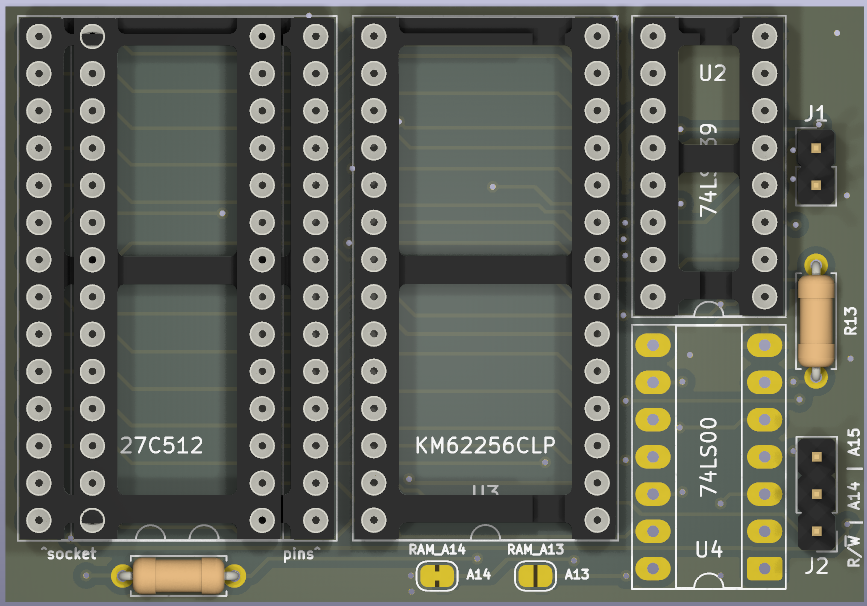
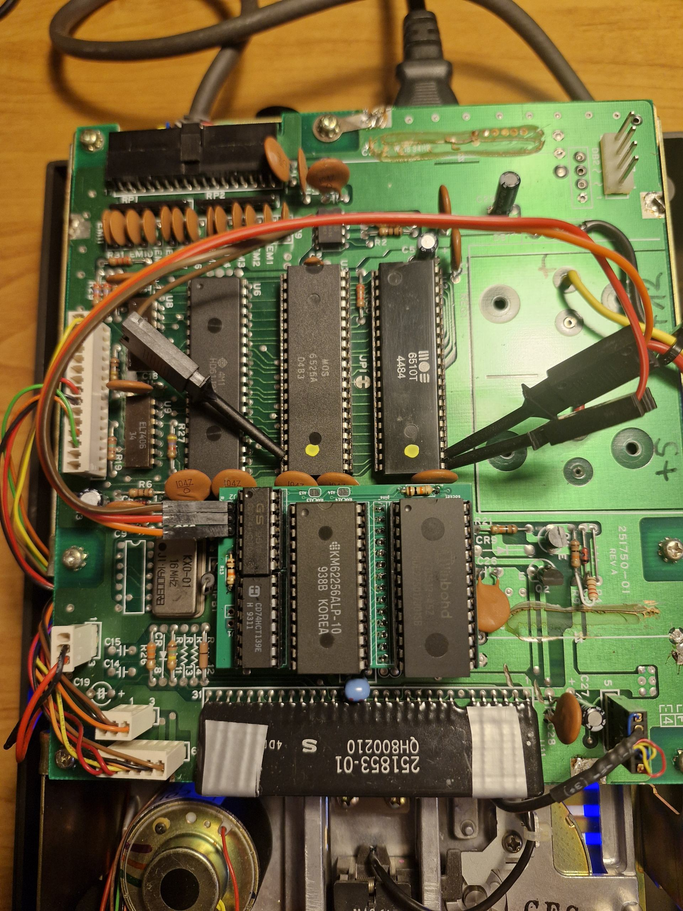
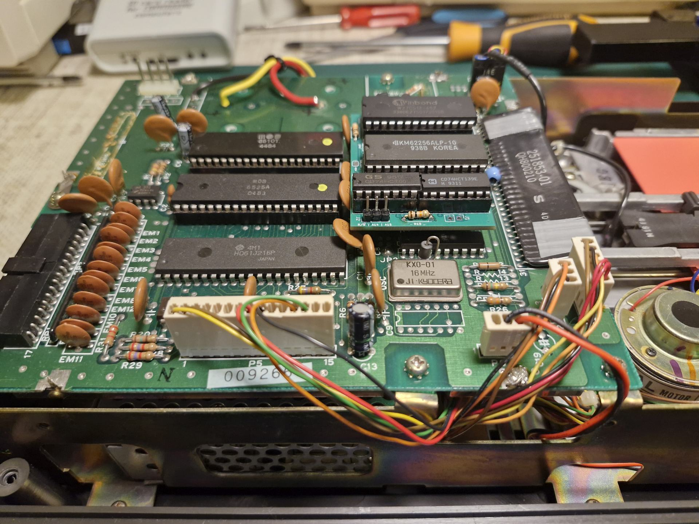
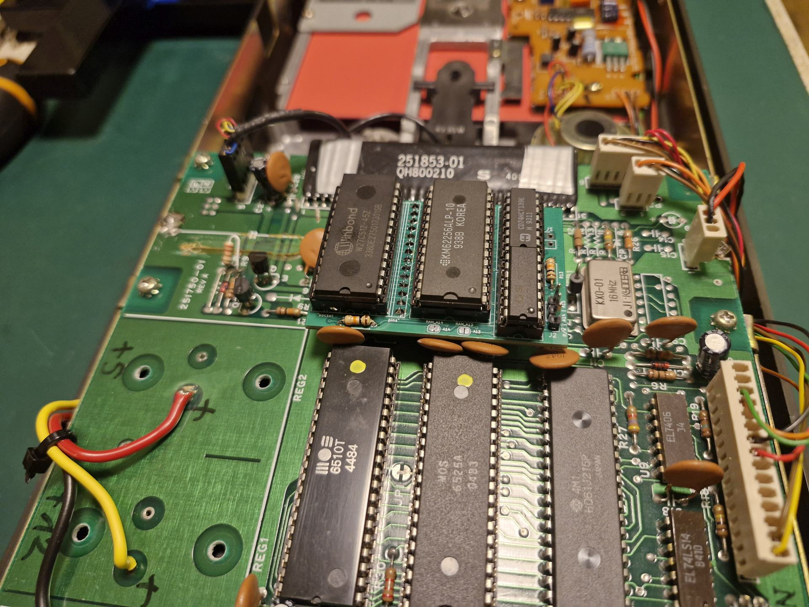
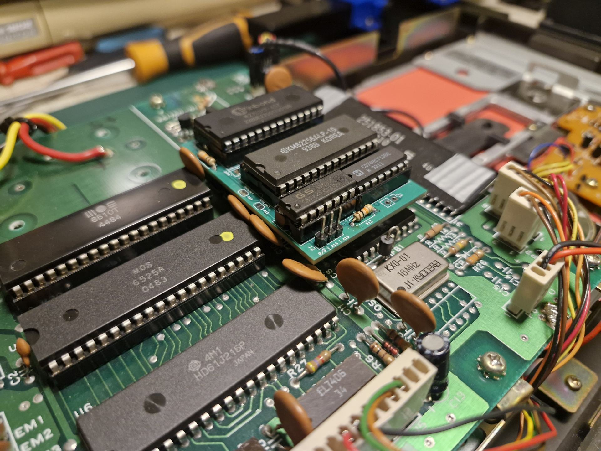
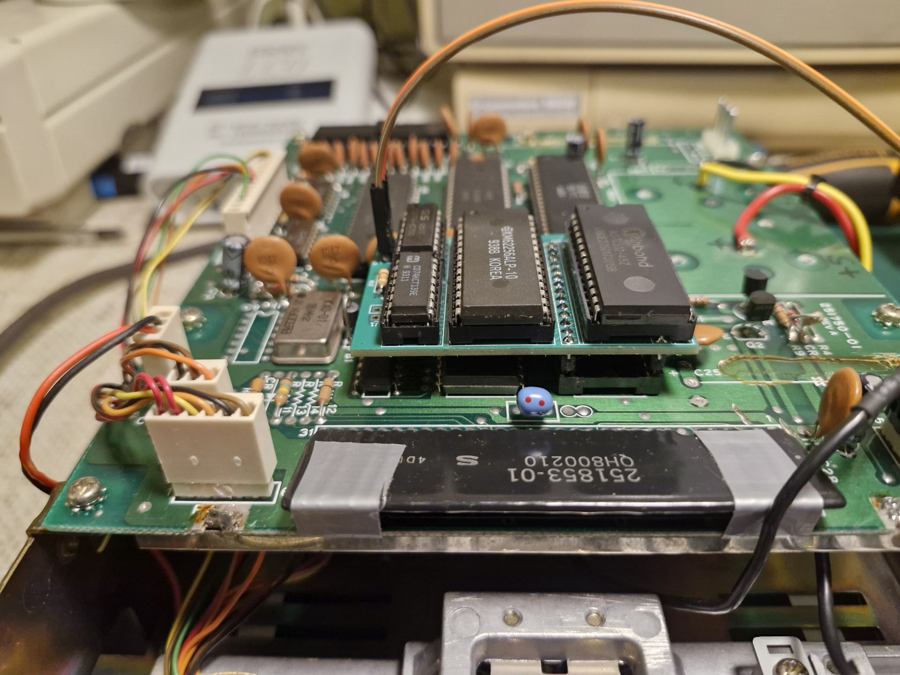

# 1551-RAMBOard (First Bank)

This project adds **8K of RAM** and **8K of extra ROM space** to a **Commodore 1551** disk drive by replacing the ROM with a small daughterboard. The extra memory is used by a ROM patch to implement a simple **track cache**: read an entire track once, then serve subsequent sector reads from RAM.

A 27x (relative to 1541) / 7x (relateive to 1551) fastloader is provided.

The mod and patched ROM are detected and utilized by [Parobek ROM](https://github.com/ytmytm/plus4-parobek).





<a href="https://www.pcbway.com/project/shareproject/1551_RAMBOard_c846331a.html"></a>

## What you get

- **RAM expansion**: `$8000-$9FFF` (8K) mapped to SRAM on the daughterboard.
- **Extra ROM window**: `$A000-$BFFF` (8K) mapped to the *upper* part of a larger ROM image.
- **Two DOS ROMs**: with a 64K ROM chip, you can add a switch to select either the stock 1551 ROM or the patched ROM
- **HypaRAM**: fastloader
- **Parobek support**: even faster fastloader startup when drivecode is embedded in patched ROM

## Videos

<a href="https://www.youtube.com/watch?v=vWi2URbmIlo" target="_blank">
 <small>Click for 1551 demonstration, loading a 108 block file</small></p>
</a>

<a href="https://www.youtube.com/watch?v=xZMYda7cszA" target="_blank">
 <small>Click for Pi1551 HypaRAM demonstration, loading a 220 block file</small></p>
</a>

## Hardware

This board plugs into the original ROM socket and adds:

- **SRAM**: 8Kx8 (6264) or 32Kx8 (e.g. 62256). Only 8K is used by default; the remaining space is reserved for future banking options.
- **ROM**: 27C512/27E512 (64K). The board maps the active 32K half into `$8000-$FFFF`, but `$8000-$9FFF` is covered by RAM, so effectively the ROM is visible at `$A000-$FFFF` (24K). This is exactly the same setup as DolphinDOS on 1571
- **Glue logic**: `74LS139` + `74LS00`.

### BOM

- 1x 14-pin DIP socket
- 1x 16-pin DIP socket
- 2x 28-pin DIP socket
- 2x 14-pin round pinheaders ("precision" ones)
- 2x 10K resistors
- 1x 74LS00 (or HCT)
- 1x 74LS139 (or HCT)
- 1x 27E256 / 27E512 (32K or 64K EEPROM)
- 1x 6264 or 62256 (8K or 32K SRAM)
- 1x switch (for ROM selection: open or closed)

### Assembly







1. Start by soldering the pin headers to the holes marked "pins". Make sure their longer sections point toward the bottom. The board uses these to plug into the existing ROM socket.

2. Solder the remaining components: two resistors, then the sockets.

3. Flash the EEPROM with the ROM image from the Releases tab. The 64K image contains the patched ROM in the top half (selected by default when `J1` is open), so you do not need to connect the switch yet.

4. Insert the chips into their sockets.

5. Open the 1551, remove the ROM chip (U4), and plug the board in its place. Ensure correct pin alignment.

6. Connect the remaining signals—`A14`, `A15`, and `R/~W`—as described in the Wiring section below.




### Wiring

- **J1 (ROM bank select for 27C512)**:
  - **short**: bottom 32K of the 64K ROM
  - **open**: top 32K of the 64K ROM
- **J2 (3-wire tap from the 1551 mainboard)**:
  - **A14** from CPU **U2 pin 21** (or **U7 pin 7**)
  - **A15** from CPU **U2 pin 22** (or **U7 pin 6**)
  - **R/~W**: **do not** take raw R/W directly from the CPU. Use the qualified R/~W that actually goes to RAM:
    - onboard RAM **U5 pin 21**, or
    - **U3 pin 19**

### Jumpers

`RAM_A13` and `RAM_A14` jumpers are configured in such a way that you can plug in either SRAM 6264 (8K) or 62256 (32K) with no other changes.
If a method to latch two bits for the necessary port selection is found, then with 62256 (32K) four banks of 8K could be selected - e.g. for a permanent cache of the directory track.

### Quickstart

1. Install the hardware and keep J1 open
2. Use a 27E512 ROM with provided 64K ROM file
3. Try running a simple BASIC program to read the ROM at `$a000` - with J1 open it should be the top, patched half with `RAM` signature
4. If you see `RAM` in the output and you can load the directory then everything works - directory track was already put into cache

```
10 open 15,8,15,"m-r"+chr$(0)+chr$(160)+chr$(3)
20 for i=1 to 3
30 get#15,b$
40 print asc(b$);b$
50 next
60 close 15
```

## Project files (KiCad)

Everything you need is attached to the Release page too.

- [KiCad project](kicad/1551-RAMBoard-FirstBank/)
- [Schematic PDF](kicad/1551-RAMBoard-FirstBank/plots/1551-RAMBoard2-FirstBank.pdf)
- [Gerbers](kicad/1551-RAMBoard-FirstBank/plots/)

## Firmware patch / build

The patcher is a single KickAssembler source file: `rampatch.asm`.

### Windows (build.bat)

**Requirements**

- Java
- [KickAssembler](http://www.theweb.dk/KickAssembler/Main.html#frontpage) at `tools/KickAss.jar`
- Stock 1551 ROM at `rom/1551.318008-01.bin` (downloaded from [zimmers.net](https://www.zimmers.net/anonftp/pub/cbm/firmware/drives/new/1551/1551.318008-01.bin))

**Build**

```bat
build.bat
```

This will produce:

- `1551.318008-01-patched.bin` (patched 32K ROM image)
- `1551.318008-01-64k.bin` (64K ROM image for EPROM: stock ROM in the bottom half and patched ROM in the top half)

### Linux (Makefile)

**Requirements**

- `make`
- Java
- [KickAssembler](http://www.theweb.dk/KickAssembler/Main.html#frontpage) at `tools/KickAss.jar`
- `curl` or `wget` (optional; used to auto-download the ROM)
- `acme` (optional; used to build example wedge fastloader HypaRAM)

**Build**

```sh
make
```

The default target builds both `1551.318008-01-patched.bin` (32K) and `1551.318008-01-64k.bin` (64K):

The 64K image is suitable for 27C512/27E512 EPROMs with:
- First 16K: $ff bytes (EPROM neutral)
- Next 16K: stock 1551 ROM
- Upper 32K: patched 1551 ROM

## HypaRAM fastloader wedge

An example fastloader wedge called **HypaRAM** is included in the `src/` directory as `hypainstall14f0.s`, which
generates `hyparam_1551.prg`.

When loaded it will intercept LOAD operations and will run the fastloader embedded in the patched drive ROM directly.
With track cache the speedup is approximately **27x** relative to 1541 and **7x** relative to stock 1551.

For simplicity it supports only device #8 and doesn't check if the ROM was patched.

The same fastloader i embedded in [Parobek ROM](https://github.com/ytmytm/plus4-parobek) and will be autodetected for LOAD operations.

### Building HypaRAM

To build the binary `hyparam_1551.prg`, you need the [ACME assembler](https://sourceforge.net/projects/acme-crossass/).

- **Windows**:  
  ```
  acme hypainstall14f0.s
  ```

- **Linux/Unix/WSL**:  
  ```
  make
  ```

The produced binary `hyparam_1551.prg` can be loaded into C16/+4 emulators or real hardware with the RAMBoard installed.

## Testing in VICE

This repo contains `docs/vice-1551-ram-expansion.patch`, which documents the changes needed for VICE to emulate:

- 1551 RAM expansion at `$8000-$9FFF`
- the 32K ROM mapping with RAM overlay

## ROM signature / API stub

The patched ROM contains a small fixed-location signature and a public jump table:

- `$A000-$A002`: ASCII signature `"RAM"` (used to detect that the patched ROM is active)
- `$A003...`: jump table entries

This is used by the HypaRAM fastloader and [Parobek ROM](https://github.com/ytmytm/plus4-parobek).

## Theory of operation

### Address space

The onboard logic enables ROM only in `$C000-$FFFF` range. We ignore this signal and instead use CPU's A15 line as a trigger which signals that `$8000-$FFFF` range is being accessed.

The 74LS139 logic uses A14 to further divide that range to generate chip select signals for RAM in `$8000-$9FFF` range and for ROM in `$A000-$FFFF`.

### Track cache logic

When the drive firmware requests a sector read:

- If the requested track is already cached, the sector is copied from expanded RAM into the target buffer and execution returns to the original ROM flow.
- Otherwise, the patched code reads the entire track, caching **decoded sector data** in expanded RAM and collecting sector numbers from headers to build the lookup table.

The whole track is captured within **one disk revolution** (about **200 ms at 300 rpm**).

### GCR decoding on 1551

Unlike 1541-class drives, the 1551 ROM already decodes GCR **on the fly** during reads (made possible by the 2 MHz CPU). The patch reuses the same approach.

## Related

- design for 1541: [**1541-RAMBOard**](https://github.com/ytmytm/1541-RAMBOardII)
- design for 1571: [**1571 Track Cache ROM**](https://github.com/ytmytm/1571-TrackCacheROM)


